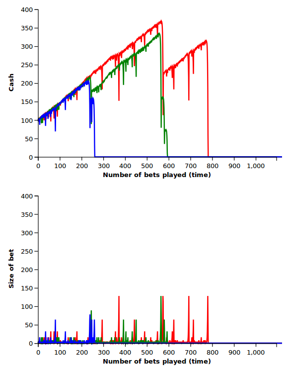

# roulettesim

A simulation of the strategy explained here:
https://www.youtube.com/watch?v=w-biT2Ix3bU

## Usage

From the terminal and the project root directory, do
```
lein gorilla
```
Open the web browser and visit the URL provided in the terminal.

From the menu on the web page, open the file ```roulette.clj```. Press ```Shift+Enter``` in every cell to run it.

## Results

Results from three different tests:




## License

Copyright © 2017 FIXME

Distributed under the Eclipse Public License either version 1.0 or (at
your option) any later version.
